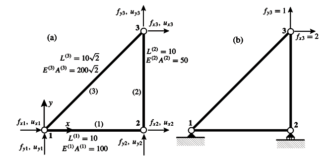
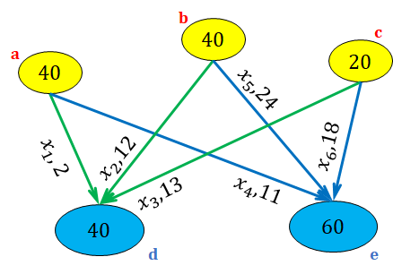

# Práctica 2

## Sistemas lineales

<iframe src="https://drive.google.com/file/d/1ae3s6DeJwpXH790Qa7IUkJZZBe4Y0PxW/preview" width="640" height="480"></iframe>

- [Notebook](https://drive.google.com/file/d/17SNk65N-yEGxZzDMxnvKOi778X_Y0_4h)  

### archivos auxiliares
-   

## Interpolación Polinomial

<iframe src="https://drive.google.com/file/d/1VvivKTyNOmAZglvRHQSMsCOViFfDpTrD/preview" width="640" height="480"></iframe>

- [Notebook](https://drive.google.com/file/d/1besruWjfCmXxEm3RYj63nQSlrG5KiMcy)  

## Mínimos cuadrados lineales

<iframe src="https://drive.google.com/file/d/1YQeEyAUKHBCX3XGAEId6AdkRTX8f1X9S/preview" width="640" height="480"></iframe>

- [Notebook](https://drive.google.com/file/d/1BW0kBUL7MVqCoGQzroCua__aQXPTLl_F)  

## Optimización

<iframe src="https://drive.google.com/file/d/1u5XVHZZPkVORVf68xCFo0PQ9aOqvG9Oj/preview" width="640" height="480"></iframe>

- [Notebook](https://drive.google.com/file/d/1A3c_nAIcm2DKd0Xnd6aYDro8umXg5pUi)  

### archivos auxiliares

-   
- [velocidad_corrosion.csv](https://drive.google.com/file/d/1fqx0K2d5Vep4tz_fPYirUzoBm8B0N1ur)
 